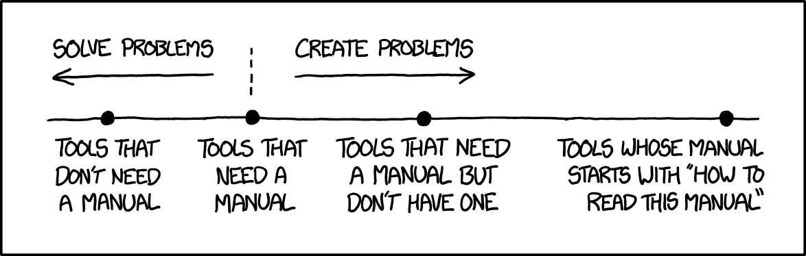

_Last updated: _

# What This Guide Is (and Isn't)

> Mathematics is one of the most beautiful things in the world and it brings joy and fulfilment and frustration in equal measure, and what more could you possibly want out of life.  
>
> — *Graham A. Niblo*

This is not a Maths textbook.

It won’t teach you how to compute an integral or prove a theorem step by step. It won’t replace lectures, problem sheets, or workshops, and it isn’t a shortcut through the degree.

Think of it instead as a transition guide, written from inside the experience and not from the other side of it.

There are countless books and resources about transitioning to university mathematics. However, most I found were written by people who had already finished the journey and looked back with clarity and hindsight, so I wanted something written from inside the process — something honest that reflects what progress feels like while it’s happening.

This guide is written by a student who is still in the process of learning how to do university mathematics. That matters. It means the reflections here are not polished by years of hindsight, but shaped by recent confusion, breakthroughs, stress before exams, and moments where something finally clicked.

There is a difference between having mathematical tools and knowing how to use them in unfamiliar territory. At school, I often felt like I was collecting tools, and when I came to university, I realised I didn't always know how to use them.

This guide is not comprehensive. It does not cover every module or every scenario. It is simply an attempt to articulate the parts of the degree that are rarely written down: the mindset shift, the moments of doubt, the practical habits that make things easier, and the difference between understanding something and merely recognising it.

In the chapters that follow, I’ll talk about:

- The shift from school mathematics to university mathematics  
- What lectures, coursework, and workshops are really for  
- How to approach problem solving when you don’t immediately know what to do  
- The temptation to outsource thinking, and what that costs  
- Revision, exams, and time management  
- Asking for help, giving useful feedback, and making the most of helpful resources  

This guide isn’t here to solve every possible problem you may encounter, but it is here to help you think about *how you learn*. You don’t need to read it all at once. Some chapters might resonate immediately, others might make more sense later.

University mathematics is demanding, but also deeply rewarding. And this guide is simply an attempt to make the path into it a little clearer.

I’ve also scattered a few [xkcd](https://xkcd.com/) references along the way because sometimes a well-timed joke explains the mood of mathematics better than a paragraph ever could.

Not everyone signs up for a maths degree wanting a philosophical reflection on learning, and that’s completely fine. But if you want to care about **how you learn**, and not just *what* you learn, I hope this helps.

::: {.callout-note}
## Prefer reading offline?

You can download the full PDF version of this guide here:

[Download the PDF](assets/pdf/field-guide.pdf)
:::

{width=50%}

*Source: [xkcd 1343 — Manuals](https://xkcd.com/1343/)*
